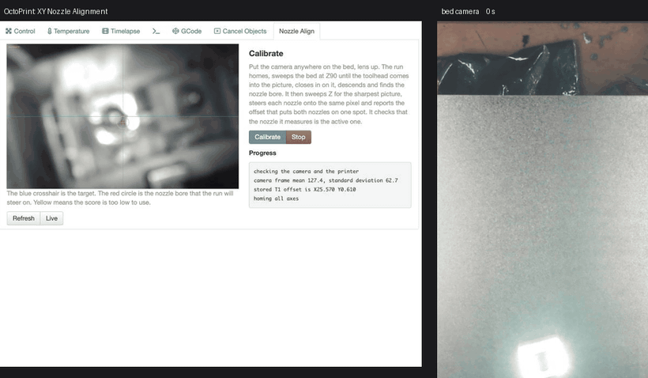

# XY nozzle alignment for the Snapmaker A350 dual extruder

An OctoPrint plugin that measures the XY offset between the two nozzles with a
camera that sits on the bed and looks up, and writes the result to the
firmware with `M218`.

The camera is the Printables "XY Nozzle Alignment Camera" (model 1099576), an
OV9726 module in a printed mount. It streams through go2rtc. See
`printpc/` for the stream configuration that works.



One run from scratch, about 30 times faster than real time. The tab is on the
left and the bed camera is on the right. The run homes, sweeps the bed for the
camera, closes in on the toolhead, finds the bore, sweeps Z for the sharpest
picture, centres each nozzle on the same pixel, homes again, and reports that
nozzle 1 landed 0.01 mm from nozzle 0. The last few seconds are the write to
the firmware and its read-back.

## What a run does

Press **Calibrate** on the Nozzle Align tab. The run:

1. Homes, selects T0, and goes to the stored camera point through the safe
   height.
2. Finds the camera. Nothing is remembered about where it is. At Z90,
   where the camera sees about 75 by 47 mm, the head searches outward from
   the middle of the bed in a growing rectangle: each ring scans its two new
   rows in one continuous X move while the camera watches, and extends every
   older row by one column each side. Frames are compared with the one
   before after the lighting is filtered out, and a change only counts when
   the moved texture forms one large connected patch. The bed and the camera
   do not move with X, so only the toolhead can do that; its cable chain and
   its LED beam crossing the lens change scattered pixels, not a patch. A
   sighting is confirmed with a nudge, the head walks on until the toolhead
   leaves the picture in X and in Y, takes the middle of each stretch, and
   climbs to where the most of the toolhead moves with a nudge, which is its
   middle. The fraction that moves cannot place the toolhead in X, because
   the toolhead is nearly as wide as the field there and the fraction is flat
   across it; the position of the moving patch in the picture can, so the
   run reads that instead. A nudge gives the picture's direction and scale
   for machine X, and the offset of the patch from the middle of the picture
   along that direction is how far to move. Two passes settle it to under a
   millimetre. The run then descends half an offset towards T0's side and
   searches a 25 mm ring for the bore. The camera can be put anywhere on the
   bed; it is found in about 50 seconds.
3. Sweeps Z and settles at the height where the bore is sharpest, coarse
   steps first and then fine ones around the peak. The camera mount, the bed
   and the lift mechanism all move the focal plane by a millimetre or two, so
   the height is measured, not trusted. A candidate with no focus peak is not
   a nozzle, and the search moves on to the next.
4. Builds the pixel map from two probe moves, each reached from the same
   direction so backlash cannot shorten it, and refuses the map if its scale
   or its shape is not plausible.
5. Steers the bore onto the target pixel and reads the machine position.
6. Selects T1 and commands the same position. The firmware applies the stored
   offset, so T1's bore must now appear near the same pixel. If it does not,
   the nozzle centred under T0 was T1's raised nozzle, not T0's active one.
   The run moves over by the nominal offset and starts again.
7. Steers T1's bore onto the same pixel and reads the position.

Both nozzles on one pixel means the image scale and the lens distortion
cancel. Only the two machine positions matter. The result is what T1 needed
beyond T0, and the offset that would make that zero. One button writes it,
reads it back, and reports whether the firmware kept it.

The run ends homed, on T0, at the safe height. A failed or stopped run parks
the same way.

Every Z command goes through one check against the floor (`min_z`, default
20 mm) and the safe height. Every travel move and every tool change happens at
the safe height. A failed or stopped run parks the head high on T0.

## The two-nozzle trap

Under T0, the nozzle that sits over the lens at X150 on this machine is not
T0's nozzle. It is T1's, raised out of use by the lift mechanism. T0's active
nozzle is 24.6 mm away in +X. The first version of this plugin centred
whatever bore it saw under each tool, so it measured T1's nozzle twice: once
raised, once lowered. The 0.13 mm it reported was the sideways tilt of the
lift, not a tool offset.

Three things told the raised nozzle from the active one, and the run now uses
the first:

- **The tool change.** Select T1 and command the same logical position. If
  the firmware's compensation is close, the other nozzle appears near the same
  pixel. If the picture shows the body of the toolhead instead, the nozzle
  just centred was the raised one, and T0's active nozzle is a nominal offset
  away in +X.
- **The focus height.** The active nozzle is lowered by about 2.4 mm, so it is
  sharpest with the head 2.4 mm higher than the raised one. On this machine
  the raised nozzle was sharpest at Z30.5 and the active ones at Z32 to Z33.
- **The wide view.** At Z90 the camera sees both nozzles at once. Under T0 at
  X150 and under T1 at X175 the pictures are identical, which proves the same
  physical nozzle sat over the lens both times.

## The offset sign, settled on the machine

`Snapmaker2-Controller` applies the hotend offset on a tool change the way
Marlin does. Selecting T1 adds the stored offset to the logical position,
tells the planner, and then moves the head back to the logical position it
had. So under T1 the head sits at `logical - stored`, and T1's nozzle lands
where T0's nozzle was only if the stored offset equals the true separation.

Measured on 2026-09-06:

- Changing the stored X by -0.130 moved the logical gap between the two
  positions by -0.129. The firmware applies the value it stores, with the
  sign Marlin gives it.
- With X25.07 Y0.35 stored, T0's active nozzle was on the target pixel at
  X175.2744 Y284.9063 and T1's at X174.7822 Y284.6174. T1 landed 0.49 mm too
  far in +X and 0.29 mm too far in +Y.

The corrected offset is `stored + (position_0 - position_1)`, which is
X25.56 Y0.64 for those numbers. `routine.corrected_offset` holds that formula
and a test pins it to the machine case.

The Snapmaker touchscreen wizard had stored X25.20 Y0.32.

## Writing to the firmware

`M218 T1 X.. Y..` stores the offset. For tool 1 the firmware also sends it to
the toolhead module over CAN, which keeps it across a power cycle without
`M500`. The plugin sends `M500` too so the controller EEPROM agrees.

Three things about the toolhead module matter:

- It keeps two decimals. The plugin rounds before it sends, so the read-back
  matches exactly.
- It rejects an X offset outside 26 &plusmn; 1.2 mm, or a Y offset outside
  0 &plusmn; 1.2 mm, and silently resets it to the default. The plugin refuses
  to send such a value, because sending it would destroy the stored offset
  rather than fail.
- Snapmaker lists `M218` as unsupported and says it may be removed. The plugin
  reads the value back after every write. If the read-back does not match, it
  puts the previous value back and says so.

The touchscreen "XY Offset Calibration" wizard writes the same value, so
running that wizard afterwards overwrites what this plugin stored.

## Numbers from this machine

- Working height Z32. The lens plane is at about Z12, so the nozzle is 20 mm
  from the lens and the picture is 75 px/mm. One pixel is 13 microns.
- The bore detector repeats to 0.01 px on a still nozzle.
- The full measurement repeated three times to 1.6 microns in X and 3.0
  microns in Y, before the two-nozzle trap was found. The method was sound;
  the nozzle was wrong.
- With X25.56 Y0.63 stored, five runs on 2026-09-06, with the camera moved
  and turned between them, reported T1 landing within 0.00 to 0.03 mm of T0.
  That is the resolution of the M114 position report.
- A full run from scratch takes 3 minutes 53 seconds: 70 s to home and
  select T0, 50 s to find the camera, 45 s for the bore ring and the focus
  sweep, and 100 s to measure both nozzles.
- Backlash on reversal is about 0.1 mm. A probe measured straight after a
  reversal gave a 12.6 px/mm map with the two columns 0.98 aligned, which is
  useless. Reaching every measurement from the same direction gave 73 px/mm
  with square columns from the same probe.

## The bore detector

Looking straight up a nozzle, the bore is a small hole in the flat tip, and the
flat tip around it catches the light as a bright collar. Once the lens is
focused properly the middle of the bore shows a bright spot, light coming back
off the inside of the nozzle, with the dark bore wall as a ring around it.

`nozzle.find_bore` scores every pixel by how much brighter its surrounding
collar is than the bore wall, and ignores the very middle. Brightness alone
picked a glint off the heater block; darkness alone picked a burnt patch on
the cone. The pair is distinctive.

The contrast of the bore changes across the frame as the lighting does. On
T1's nozzle it fell below the first-find threshold one probe move away, while
a burnt patch scored higher. So after the first find the bore is followed with
a template cut from the last frame, and the detector only refines the centre
close to where the template landed.

## Install

On the print PC, using the OctoPrint interpreter:

```
C:\OctoPrint\WPy64-31050\python-3.10.5.amd64\python.exe -m pip install numpy opencv-python-headless
C:\OctoPrint\WPy64-31050\python-3.10.5.amd64\python.exe -m pip install -e C:\OctoPrint\plugins-src\nozzlealign
net stop OctoPrint5000 & net start OctoPrint5000
```

## The camera stream

The run reads the MJPEG stream in a background thread and takes the newest
frame made after each move. A `frame.jpeg` request costs 0.6 to 0.9 seconds
on this rig and every other one comes back empty, because go2rtc starts the
camera pipeline for each snapshot consumer and drops it afterwards. Holding
the stream open gives about 8 frames a second. A full run from homing to
result takes under 4 minutes; with snapshots it took 20.

`printpc/go2rtc.yaml` and `printpc/nozzlecam.bat` are the working go2rtc
configuration. Read the comments in the yaml before you change it. Three
separate faults made the naive configuration produce a valid JPEG containing no
picture, and each fix is load bearing.

Check a stream like this. A working frame has a standard deviation well above
20. A broken one sits at mean 128 with a standard deviation near 4.

```
curl -s -o f.jpg "http://printpc.cns.me:1984/api/frame.jpeg?src=nozzle_cam"
```

## Tests

The tests run on any machine. They need no printer and no OctoPrint.

```
python3 -m venv .venv
.venv/bin/pip install numpy opencv-python-headless pillow requests pytest
.venv/bin/python -m pytest tests -q
```

`tests/fakes.py` simulates the printer with the firmware's real tool change
semantics, backlash on every reversal, and a camera that renders both nozzle
bores, the inactive one raised and shifted by the lift. `tests/test_routine.py`
runs the whole closed loop against it and checks that:

- the true offset comes back out despite backlash,
- a correct stored offset measures a zero correction,
- a raised T1 nozzle over the lens is noticed and skipped,
- the focus height is measured, and no Z goes below the floor,
- a stop or a lost connection parks the head high on T0,
- a run that does not converge is an error, not an answer.

## Bench tools

`tools/` drives the printer from a workstation, outside OctoPrint, for
experiments. See `tools/README.md`.

## Prior art

Chen and Cai, "Automatic Spatial Calibration for Dual-nozzle Extrusion-based 3D
Printers", Manufacturing Letters 44 (2025) 884-892. They use HSV segmentation, a
Hough circle transform and a right-angle prism, with a fixed 0.045 mm per pixel
scale measured by hand in ImageJ. This plugin measures the scale instead, and
covers XY only, because the camera looks straight up with no prism.

TAXY (https://github.com/PrintStructor/TAXY) and TAMV were both tried on frames
from this camera and found nothing. Both want a different view than this lens
and lighting give.
